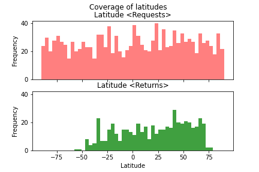

# What's the Weather Like?
> This application queries the current weather at cities around the world and creates a global picture of the weather versus latitude. It looks for relationships between key weather variables and latitude and selects your ideal location with hotel recommendations!

## Table of Contents
* [General Info](#general-information)
* [Technologies Used](#technologies-used)
* [Features](#features)
* [Screenshots](#screenshots)
* [Setup](#setup)
* [Usage](#usage)
* [Project Status](#project-status)
* [Room for Improvement](#room-for-improvement)
* [Acknowledgements](#acknowledgements)
* [Contact](#contact)

## General Information
This application has been developed in Python using Jupyter Notebook. To accomplish this, I used a [simple Python library] (https://pypi.python.org/pypi/citipy), and the [OpenWeatherMap API] (https://openweathermap.org/api. 

## Approach
The code creates 2000 random (but possible) latitude-longitude pairings and then attempts to find a proximate city using the citipy api. If the api finds a city then precise lat-long is acquired and the Open Weather Map is queried for current weather data.

The code loops until 500 unique cities have been found -  removing duplicates and skipping cities where no data is returned using ‘try and except’ – it takes about 1300 requests to generate 500 unique results. 

One important question is whether the returned cities represent a good spread of data points for the analysis. The charts below indicate that:

 

A histogram of frequency of requested latitudes and returned latitudes and frequency of requested and returned longitudes versus longitude was plotted to ensure the data points represented the full range of possible city locations

## Technologies
- Python, Jupyter Notebook, matplotlib, pandas, numpy
- https://pypi.python.org/pypi/citipy
- https://openweathermap.org/api
- https://google.places.com/api

## Features

## Screenshots

## Setup

## Room for Improvement

## Part I - WeatherPy

What's the weather like as we approach the equator?

In this example, I created a Python script to visualize the weather of 500+ cities across the world of varying distance from the equator. To accomplish this, I used a [simple Python library] (https://pypi.python.org/pypi/citipy), and the [OpenWeatherMap API] (https://openweathermap.org/api. The code randomly selects 500 unique (non-repeat) cities based on latitude and longitude removing duplicates and skipping cities where no data is returned by the OpenWeatherMap – it takes about 1300 requests to generate 500 unique results. A histogram of frequency of requested latitudes and returned latitudes and frequency of requested and returned longitudes versus longitude was plotted to ensure the data points represented the full range of possible city locations.

The code then performs a weather check on each of the cities using a series of successive API calls and includes a print log of each city as it's being processed with the city number and city name as well as maxTemp, Wind Speed, Humidity and Cloudiness. All data is saved in a
csv file. Scatter plots are produced for the above variables versus latitude and then the code separates the data into Northern and Southern Hemisphere and does a regression analysis on each of the eight plots.

 
No surprise there are correlations for maxTemp versus latitude in both hemispheres with r-squared on the 0.7 range. There is no correlation (on the day and time the data was pulled) for Wind Speed, Humidity and Cloudiness with latitude.

## Part II - VacationPy

Using the 500 city dataset from above, the code creates a heat map that displays the humidity as a heatmap for every city using the Google Maps API. The code takes user input to to find locations with the user’s ideal weather conditions. The code then calls the Google Places API to find the first hotel for each city located within 5000 meters of its coordinates.
The hotels are plotted on top of the humidity heatmap with each pin containing the Hotel Name, Hotel Address and Country.

John Russell
May 01, 2021

