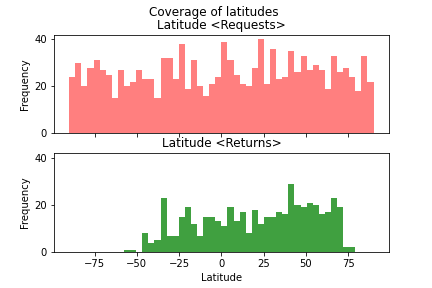
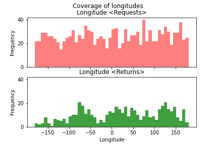
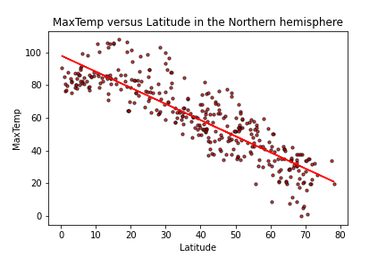
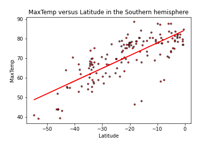
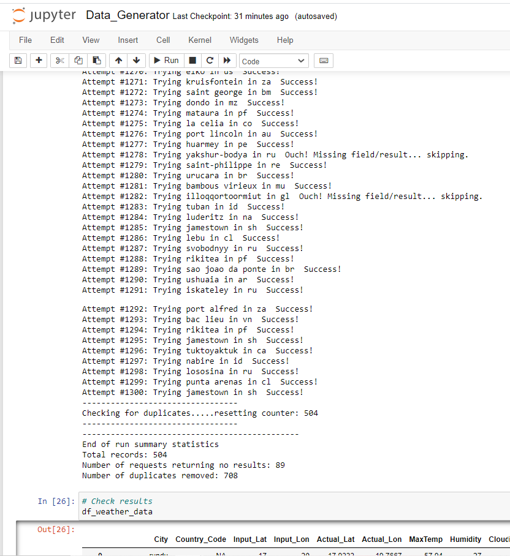

# What's the Weather Like?
> This application queries the current weather at cities around the world and creates a global picture of the weather versus latitude. It looks for relationships between key weather variables and latitude and selects your ideal location with hotel recommendations!

## Table of Contents
* [General Info](#general-information)
* [Approach](#approach)
* [What's the weather like as we approach the equator?](#approach-equator)
* [VacationPy](#vacationpy)
* [Technologies Used](#technologies-used)
* [Screenshots](#screenshots)
* [Setup](#setup)
* [Room for Improvement](#room-for-improvement)
* [Contact](#contact)

## General Information
This application has been developed in Python using Jupyter Notebook. It call 3 APIs, citipy, open weather maps and Google places.

## Approach
The code creates 2000 random (but possible) global latitude-longitude pairings and then attempts to find a proximate city using the citipy api. If the api finds a city, then a precise lat-long is acquired and passed to the Open Weather Map for current weather data. This data is stored in a pandas datframe for later analysis.

The code loops until 500 unique city datasets have been found. Approximately 1300 queries are required after duplicates and cities where no data is returned are removed. The code uses the """try:  except:""" error handling protocol to navigate these problems.  The code produces a print log of each city as it's being processed with the city number and city name

One important question is whether the returned cities represent a good spread of data points for the analysis. For that purpose the charts are generated and demonstrate that:

 

Latitude requests span the possible range (-90 to +90 degrees) and a generally uniform. The returns span the a range of -60 to +80 degrees which probably reflects the fact that there a no significant cities in those latitudes. The Northern Hemisphere and particularly 40+ degrees gave the most returns - probaly indicating N. American and European populations.

Longitude requests span the possible range (-180 to +80 degrees) and are generally uniform. The returns also span the entire range.

## What's the weather like as we approach the equator?
Scatter plots are produced for the above variables versus latitude and then the code separates the data into Northern and Southern Hemisphere and does a regression analysis on each of the eight plots.

No surprise there are correlations for maxTemp versus latitude in both hemispheres with r-squared on the 0.7 range. There is no correlation (on the day and time the data was pulled) for Wind Speed, Humidity and Cloudiness with latitude.

## VacationPy
Using the 500 city dataset from above, the code creates a heat map that displays the humidity as a heatmap for every city using the Google Maps API. The code takes user input to to find locations with the user�s ideal weather conditions. The code then calls the Google Places API to find the first hotel for each city located within 5000 meters of its coordinates.
The hotels are plotted on top of the humidity heatmap with each pin containing the Hotel Name, Hotel Address and Country.

## Technologies
- Python, Jupyter Notebook, matplotlib, pandas, numpy
- https://pypi.python.org/pypi/citipy
- https://openweathermap.org/api
- https://google.places.com/api

## Screenshots

## Setup
"python app.py"

## Room for Improvement

 

John Russell
May 01, 2021